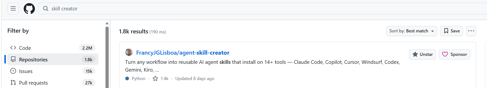
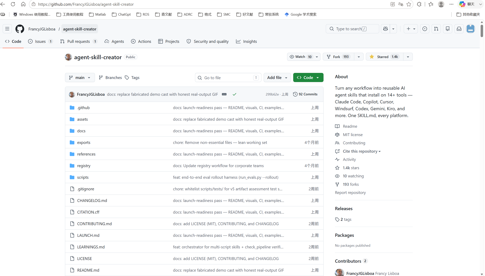
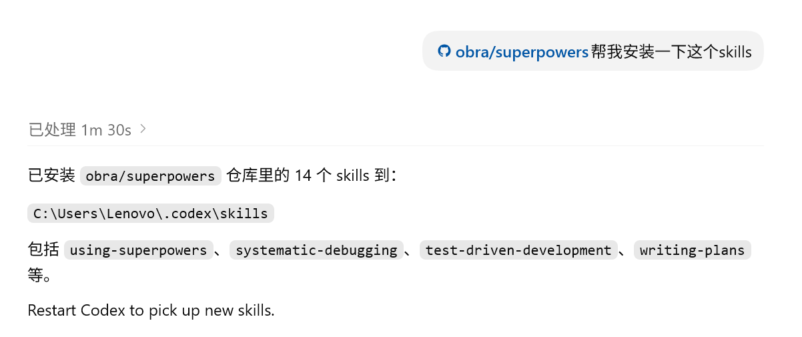

# 如何安装并使用skills（codex版）

#### 1.安装codex

在GPT首页选择codex

点击下载Windows版

#### 2.在codex主页新建一个文件夹

用于存放这个主题下的所有线程任务

#### 3.安装skills

在codex最左侧的插件里面把GitHub插件安装一下

去GitHub上搜索你想找的skills名称关键词

点开项目链接

把这个项目链接发给codex，直接跟他说帮我安装一下这个skills

安装后重启codex即可开始使用

#### 4.skills使用

触发方式通常有两种：

1. **直接点名 skill**
   例如：
   - 使用 nature-writing 帮我润色这段论文
   - 用 systematic-debugging 帮我排查这个 bug
   - Use agent-skill-creator to create a skill from this workflow
2. **描述符合 skill 的任务**
   Codex 会根据任务自动选择相关 skill。
   例如：
   - “帮我把这篇文章改成 Nature 风格”
   - “帮我系统性调试这个报错”
   - “把这个工作流做成可复用 skill”

也可以直接问codex：现在有哪些可用 skills？或者直接尝试：用 nature-polishing 帮我润色下面这段文字：...

5.个人推荐安装的skills

https://github.com/obra/superpowers

https://github.com/Yuan1z0825/nature-skills

https://github.com/FrancyJGLisboa/agent-skill-creator

superpowers负责给AI添加做事固定步骤，避免AI乱写代码。让它更靠谱

nature skills可以用来检索文献，润色文字、图片，图表制作，审稿回复

skill creator可以把重复流程变成自己的skill

这些在GitHub上可以找到的skills的使用说明通常在项目的skill.md中可以查看